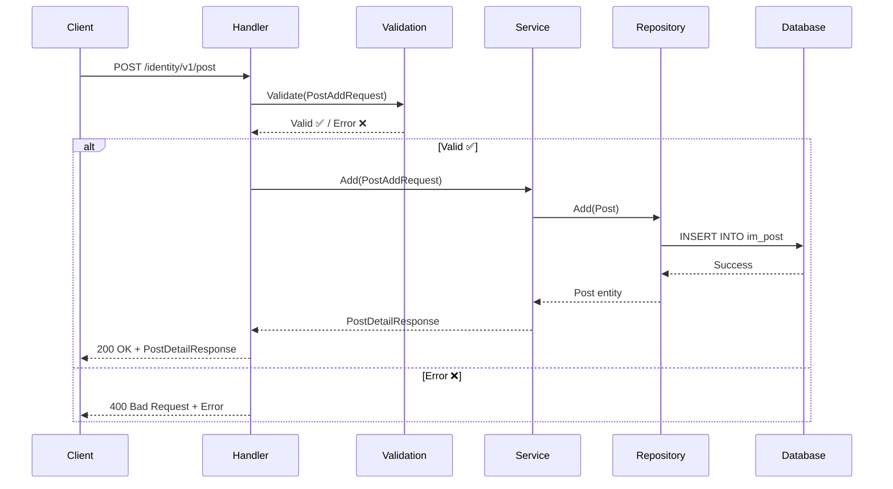
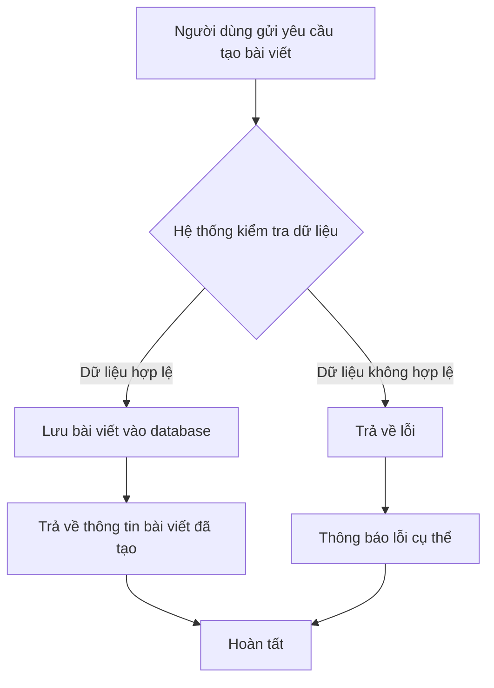

# API Thêm bài viết mới

## Tổng quan

| Thuộc tính | Giá trị |
|------------|---------|
| **Method** | POST |
| **Endpoint** | `/identity/v1/post` |
| **Mô tả** | Tạo mới một bài viết cho user |
| **Tags** | identity |

---

## Mục đích sử dụng

### 👤 Dành cho Business / Non-tech
- Cho phép người dùng tạo bài viết mới trên hệ thống
- Mỗi bài viết cần có tiêu đề và nội dung
- Bài viết sẽ được gắn với một user cụ thể (thông qua user_id)

### 🛠️ Dành cho Developer
- API dùng để tạo record mới trong bảng `im_post`
- Validate dữ liệu đầu vào trước khi lưu vào database
- Tự động thêm timestamp khi tạo mới

---

## Request Parameters

### Headers
| Parameter | Type | Required | Description |
|-----------|------|----------|-------------|
| Content-Type | string | ✅ | `application/json` |
| Accept-Language | string | ❌ | Ngôn ngữ: `en` hoặc `vi` |

### Body
| Parameter | Type | Required | Description | Validation |
|-----------|------|----------|-------------|------------|
| user_id | uint64 | ✅ | ID của user tạo bài viết | > 0 |
| title | string | ✅ | Tiêu đề bài viết | 3-200 ký tự |
| content | string | ✅ | Nội dung bài viết | Không được rỗng |

### Ví dụ Request
```json
{
  "user_id": 1,
  "title": "Bài viết đầu tiên của tôi",
  "content": "Đây là nội dung bài viết..."
}
```

---

## Response

### Success Response (200)
```json
{
  "code": "success",
  "message": "Thêm bài viết thành công",
  "data": {
    "id": 1,
    "user_id": 1,
    "title": "Bài viết đầu tiên của tôi",
    "content": "Đây là nội dung bài viết...",
    "created_at": "2024-01-15T10:30:00Z",
    "modified_at": "2024-01-15T10:30:00Z",
    "status": 0
  }
}
```

### Error Responses
| HTTP Code | Code | Message | Description |
|-----------|------|---------|-------------|
| 400 | not_allow | Dữ liệu không hợp lệ | Request body không đúng format |
| 400 | post_invalid_user_id | User ID không hợp lệ | user_id = 0 hoặc không tồn tại |
| 400 | post_invalid_title | Tiêu đề không hợp lệ | Title < 3 hoặc > 200 ký tự |
| 400 | post_invalid_content | Nội dung không hợp lệ | Content rỗng |

---

## Sequence Diagram

### 🧑‍💻 Dành cho Developer (Technical)



### 👥 Dành cho Business / Non-tech



---

## Ví dụ sử dụng (cURL)

### Thêm bài viết mới
```bash
curl -X POST http://localhost:8080/identity/v1/post \
  -H "Content-Type: application/json" \
  -H "Accept-Language: vi" \
  -d '{
    "user_id": 1,
    "title": "Bài viết đầu tiên của tôi",
    "content": "Đây là nội dung bài viết..."
  }'
```

### Response thành công
```json
{
  "code": "success",
  "message": "Thêm bài viết thành công",
  "data": {
    "id": 1,
    "user_id": 1,
    "title": "Bài viết đầu tiên của tôi",
    "content": "Đây là nội dung bài viết...",
    "created_at": "2024-01-15T10:30:00Z",
    "modified_at": "2024-01-15T10:30:00Z",
    "status": 0
  }
}
```

---

## Lưu ý quan trọng

1. **User tồn tại**: user_id phải tồn tại trong hệ thống, nếu không sẽ trả về lỗi database
2. **Độ dài title**: Tối thiểu 3 ký tự, tối đa 200 ký tự
3. **Content**: Không được để trống
4. **Status mặc định**: Khi tạo mới, status = 0 (nháp/draft)
5. **Timestamps**: Hệ thống tự động thêm created_at và modified_at