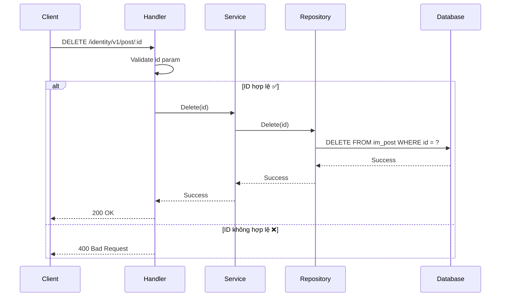
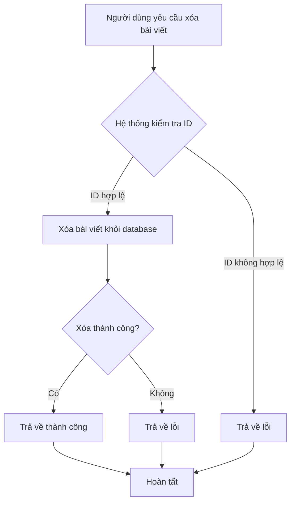

# API Xóa bài viết

## Tổng quan

| Thuộc tính | Giá trị |
|------------|---------|
| **Method** | DELETE |
| **Endpoint** | `/identity/v1/post/{id}` |
| **Mô tả** | Xóa một bài viết theo ID khỏi hệ thống |
| **Tags** | identity |

---

## Mục đích sử dụng

### 👤 Dành cho Business / Non-tech
- Cho phép người dùng xóa bài viết không cần thiết
- Dùng khi người dùng muốn gỡ bài viết khỏi hệ thống
- **Lưu ý**: Hành động này không thể hoàn tác!

### 🛠️ Dành cho Developer
- Delete một record khỏi bảng `im_post` theo id
- Sử dụng soft delete hoặc hard delete tùy cấu hình database

---

## Request Parameters

### Headers
| Parameter | Type | Required | Description |
|-----------|------|----------|-------------|
| Accept-Language | string | ❌ | Ngôn ngữ: `en` hoặc `vi` |

### Path Parameters
| Parameter | Type | Required | Description |
|-----------|------|----------|-------------|
| id | int | ✅ | ID của bài viết cần xóa |

---

## Response

### Success Response (200)
```json
{
  "code": "success",
  "message": "Xóa bài viết thành công",
  "data": null
}
```

### Error Responses
| HTTP Code | Code | Message | Description |
|-----------|------|---------|-------------|
| 400 | not_allow | Dữ liệu không hợp lệ | ID không hợp lệ hoặc bằng 0 |
| 404 | not_found | Không tìm thấy bài viết | ID không tồn tại trong database |

---

## Sequence Diagram

### 🧑‍💻 Dành cho Developer (Technical)



### 👥 Dành cho Business / Non-tech



---

## Ví dụ sử dụng (cURL)

### Xóa bài viết
```bash
curl -X DELETE http://localhost:8080/identity/v1/post/1 \
  -H "Accept-Language: vi"
```

### Response thành công
```json
{
  "code": "success",
  "message": "Xóa bài viết thành công",
  "data": null
}
```

### Response không tìm thấy
```json
{
  "code": "not_found",
  "message": "Không tìm thấy bài viết",
  "data": null
}
```

---

## Lưu ý quan trọng

1. **Hành động vĩnh viễn**: Bài viết sẽ bị xóa vĩnh viễn khỏi database
2. **ID bắt buộc**: Tham số `id` trên path là bắt buộc
3. **Không tìm thấy**: Trả về lỗi 404 nếu bài viết không tồn tại
4. **Cân nhắc**: Nên xác nhận với người dùng trước khi xóa (phía client)