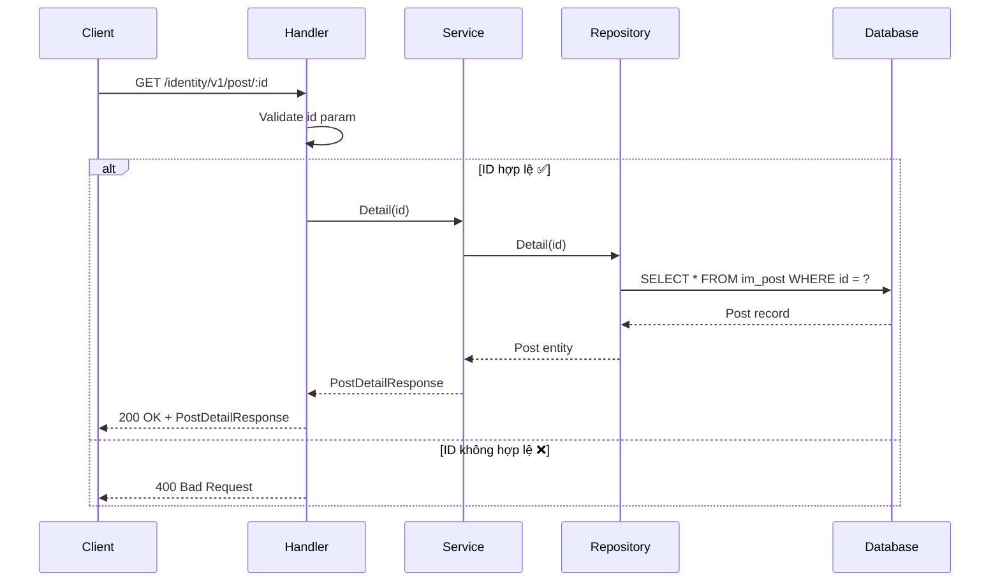
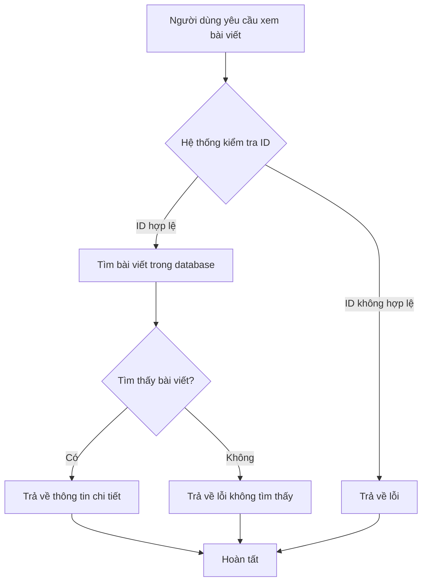

# API Lấy chi tiết bài viết

## Tổng quan

| Thuộc tính | Giá trị |
|------------|---------|
| **Method** | GET |
| **Endpoint** | `/identity/v1/post/{id}` |
| **Mô tả** | Lấy thông tin chi tiết của một bài viết theo ID |
| **Tags** | identity |

---

## Mục đích sử dụng

### 👤 Dành cho Business / Non-tech
- Cho phép xem chi tiết một bài viết cụ thể
- Dùng để hiển thị nội dung bài viết khi người dùng click vào
- Có thể dùng để chỉnh sửa bài viết

### 🛠️ Dành cho Developer
- Query một record từ bảng `im_post` theo id
- Trả về đầy đủ thông tin bài viết kể cả timestamps

---

## Request Parameters

### Headers
| Parameter | Type | Required | Description |
|-----------|------|----------|-------------|
| Accept-Language | string | ❌ | Ngôn ngữ: `en` hoặc `vi` |

### Path Parameters
| Parameter | Type | Required | Description |
|-----------|------|----------|-------------|
| id | int | ✅ | ID của bài viết cần lấy |

---

## Response

### Success Response (200)
```json
{
  "code": "success",
  "message": "Lấy thông tin bài viết thành công",
  "data": {
    "id": 1,
    "user_id": 1,
    "title": "Bài viết đầu tiên của tôi",
    "content": "Đây là nội dung bài viết...",
    "created_at": "2024-01-15T10:30:00Z",
    "modified_at": "2024-01-15T10:30:00Z",
    "status": 1
  }
}
```

### Error Responses
| HTTP Code | Code | Message | Description |
|-----------|------|---------|-------------|
| 400 | not_allow | Dữ liệu không hợp lệ | ID không hợp lệ hoặc bằng 0 |
| 404 | not_found | Không tìm thấy bài viết | ID không tồn tại trong database |

---

## Sequence Diagram

### 🧑‍💻 Dành cho Developer (Technical)



### 👥 Dành cho Business / Non-tech



---

## Ví dụ sử dụng (cURL)

### Lấy chi tiết bài viết
```bash
curl -X GET http://localhost:8080/identity/v1/post/1 \
  -H "Accept-Language: vi"
```

### Response thành công
```json
{
  "code": "success",
  "message": "Lấy thông tin bài viết thành công",
  "data": {
    "id": 1,
    "user_id": 1,
    "title": "Bài viết đầu tiên của tôi",
    "content": "Đây là nội dung bài viết...",
    "created_at": "2024-01-15T10:30:00Z",
    "modified_at": "2024-01-15T10:30:00Z",
    "status": 1
  }
}
```

### Response không tìm thấy
```json
{
  "code": "not_found",
  "message": "Không tìm thấy bài viết",
  "data": null
}
```

---

## Lưu ý quan trọng

1. **ID bắt buộc**: Tham số `id` trên path là bắt buộc
2. **Không tìm thấy**: Trả về lỗi 404 nếu bài viết không tồn tại
3. **Timestamps**: Response bao gồm cả created_at và modified_at
4. **Status**: Trả về trạng thái hiện tại của bài viết (0: nháp, 1: đã đăng, 2: draft)