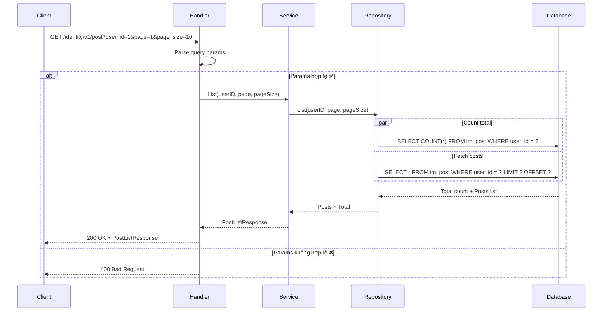
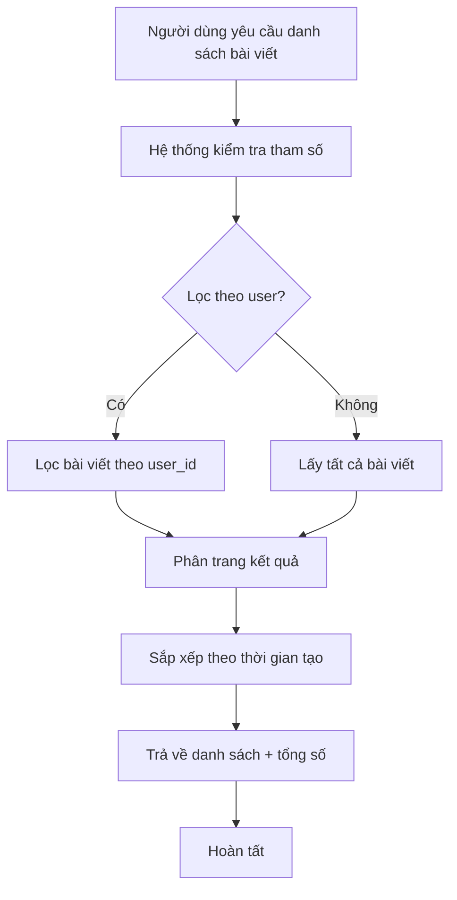

# API Danh sách bài viết

## Tổng quan

| Thuộc tính | Giá trị |
|------------|---------|
| **Method** | GET |
| **Endpoint** | `/identity/v1/post` |
| **Mô tả** | Lấy danh sách bài viết có lọc theo user và phân trang |
| **Tags** | identity |

---

## Mục đích sử dụng

### 👤 Dành cho Business / Non-tech
- Hiển thị danh sách bài viết cho người dùng
- Có thể lọc bài viết theo user cụ thể
- Hỗ trợ phân trang để hiển thị nhiều bài viết

### 🛠️ Dành cho Developer
- Query danh sách từ bảng `im_post` với điều kiện lọc
- Hỗ trợ filter theo user_id
- Hỗ trợ phân trang (page, page_size)
- Trả về tổng số bài viết để tính toán pagination

---

## Request Parameters

### Headers
| Parameter | Type | Required | Description |
|-----------|------|----------|-------------|
| Accept-Language | string | ❌ | Ngôn ngữ: `en` hoặc `vi` |

### Query Parameters
| Parameter | Type | Required | Description | Default |
|-----------|------|----------|-------------|---------|
| user_id | int | ❌ | Lọc theo user ID | - |
| page | int | ❌ | Số trang hiện tại | 1 |
| page_size | int | ❌ | Số bài viết trên một trang | 10 |

---

## Response

### Success Response (200)
```json
{
  "code": "success",
  "message": "Lấy danh sách bài viết thành công",
  "data": {
    "posts": [
      {
        "id": 2,
        "user_id": 1,
        "title": "Bài viết thứ hai",
        "content": "Nội dung bài viết thứ hai...",
        "created_at": "2024-01-15T12:00:00Z",
        "modified_at": "2024-01-15T12:00:00Z",
        "status": 1
      },
      {
        "id": 1,
        "user_id": 1,
        "title": "Bài viết đầu tiên",
        "content": "Nội dung bài viết đầu tiên...",
        "created_at": "2024-01-15T10:30:00Z",
        "modified_at": "2024-01-15T10:30:00Z",
        "status": 1
      }
    ],
    "total": 2,
    "page": 1,
    "page_size": 10
  }
}
```

### Error Responses
| HTTP Code | Code | Message | Description |
|-----------|------|---------|-------------|
| 400 | not_allow | Dữ liệu không hợp lệ | Tham số phân trang không hợp lệ |

---

## Sequence Diagram

### 🧑‍💻 Dành cho Developer (Technical)



### 👥 Dành cho Business / Non-tech



---

## Ví dụ sử dụng (cURL)

### Lấy danh sách tất cả bài viết
```bash
curl -X GET "http://localhost:8080/identity/v1/post" \
  -H "Accept-Language: vi"
```

### Lọc theo user và phân trang
```bash
curl -X GET "http://localhost:8080/identity/v1/post?user_id=1&page=1&page_size=10" \
  -H "Accept-Language: vi"
```

### Response thành công
```json
{
  "code": "success",
  "message": "Lấy danh sách bài viết thành công",
  "data": {
    "posts": [
      {
        "id": 2,
        "user_id": 1,
        "title": "Bài viết thứ hai",
        "content": "Nội dung bài viết thứ hai...",
        "created_at": "2024-01-15T12:00:00Z",
        "modified_at": "2024-01-15T12:00:00Z",
        "status": 1
      }
    ],
    "total": 1,
    "page": 1,
    "page_size": 10
  }
}
```

---

## Lưu ý quan trọng

1. **Phân trang**: 
   - Page mặc định: 1
   - Page_size mặc định: 10
   - Page_size tối đa: 100
2. **Sắp xếp**: Kết quả được sắp xếp theo `created_at` giảm dần (mới nhất trước)
3. **Lọc theo user**: Nếu không truyền `user_id`, sẽ trả về tất cả bài viết
4. **Tổng số**: Trường `total` giúp tính toán số trang cần hiển thị
5. **Empty list**: Trả về mảng rỗng `[]` nếu không có bài viết nào