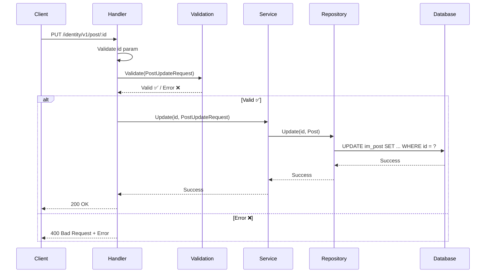
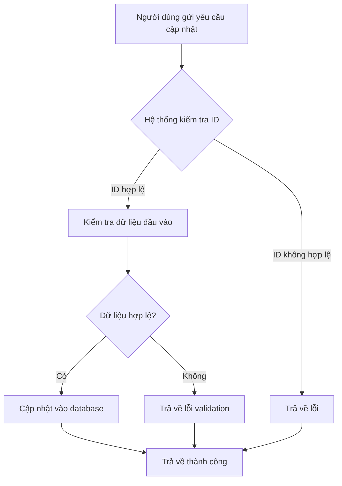

# API Cập nhật bài viết

## Tổng quan

| Thuộc tính | Giá trị |
|------------|---------|
| **Method** | PUT |
| **Endpoint** | `/identity/v1/post/{id}` |
| **Mô tả** | Cập nhật thông tin một bài viết theo ID |
| **Tags** | identity |

---

## Mục đích sử dụng

### 👤 Dành cho Business / Non-tech
- Cho phép người dùng chỉnh sửa nội dung bài viết
- Có thể thay đổi tiêu đề, nội dung và trạng thái bài viết
- Dùng khi người dùng muốn cập nhật bài viết đã đăng

### 🛠️ Dành cho Developer
- Update một record trong bảng `im_post` theo id
- Chỉ update các trường được gửi lên (partial update)
- Tự động cập nhật modified_at timestamp

---

## Request Parameters

### Headers
| Parameter | Type | Required | Description |
|-----------|------|----------|-------------|
| Content-Type | string | ✅ | `application/json` |
| Accept-Language | string | ❌ | Ngôn ngữ: `en` hoặc `vi` |

### Path Parameters
| Parameter | Type | Required | Description |
|-----------|------|----------|-------------|
| id | int | ✅ | ID của bài viết cần cập nhật |

### Body
| Parameter | Type | Required | Description | Validation |
|-----------|------|----------|-------------|------------|
| title | string | ❌ | Tiêu đề bài viết mới | 3-200 ký tự (nếu có) |
| content | string | ❌ | Nội dung bài viết mới | Không giới hạn |
| status | int | ❌ | Trạng thái mới | 0: nháp, 1: đã đăng, 2: draft |

### Ví dụ Request
```json
{
  "title": "Tiêu đề đã chỉnh sửa",
  "content": "Nội dung đã cập nhật...",
  "status": 1
}
```

---

## Response

### Success Response (200)
```json
{
  "code": "success",
  "message": "Cập nhật bài viết thành công",
  "data": null
}
```

### Error Responses
| HTTP Code | Code | Message | Description |
|-----------|------|---------|-------------|
| 400 | not_allow | Dữ liệu không hợp lệ | ID không hợp lệ hoặc request body lỗi |
| 400 | post_invalid_title | Tiêu đề không hợp lệ | Title < 3 hoặc > 200 ký tự |
| 404 | not_found | Không tìm thấy bài viết | ID không tồn tại trong database |

---

## Sequence Diagram

### 🧑‍💻 Dành cho Developer (Technical)



### 👥 Dành cho Business / Non-tech



---

## Ví dụ sử dụng (cURL)

### Cập nhật bài viết
```bash
curl -X PUT http://localhost:8080/identity/v1/post/1 \
  -H "Content-Type: application/json" \
  -H "Accept-Language: vi" \
  -d '{
    "title": "Tiêu đề đã chỉnh sửa",
    "content": "Nội dung đã cập nhật...",
    "status": 1
  }'
```

### Response thành công
```json
{
  "code": "success",
  "message": "Cập nhật bài viết thành công",
  "data": null
}
```

### Response lỗi validation
```json
{
  "code": "post_invalid_title",
  "message": "Tiêu đề không hợp lệ",
  "data": null
}
```

---

## Lưu ý quan trọng

1. **Partial Update**: Chỉ cần gửi các trường cần cập nhật, không bắt buộc gửi tất cả
2. **Title validation**: Nếu gửi title, phải có độ dài 3-200 ký tự
3. **Tự động cập nhật**: Trường modified_at được tự động cập nhật khi update
4. **Status values**: 
   - `0`: Nháp (default)
   - `1`: Đã đăng (published)
   - `2`: Bản nháp (draft)
5. **Không tìm thấy**: Trả về lỗi 404 nếu bài viết không tồn tại