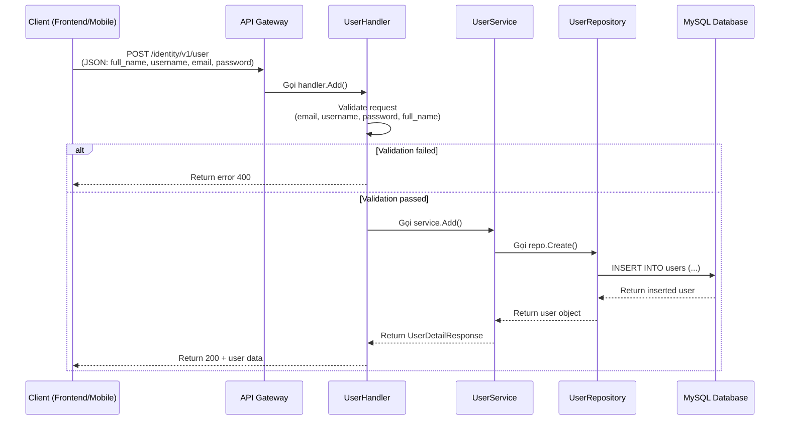
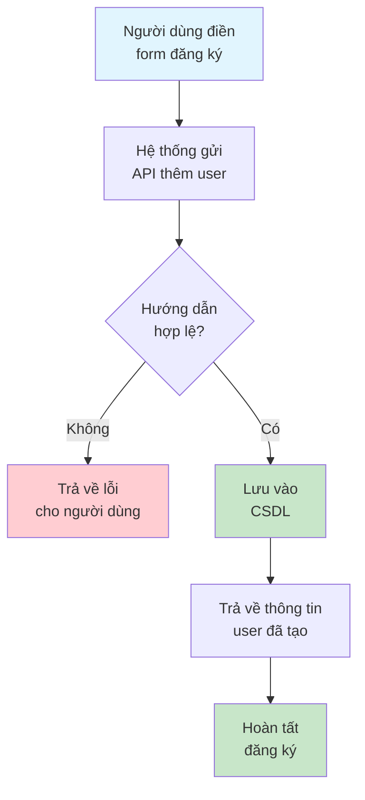

# API: Thêm User Mới

## Tổng quan

| Thuộc tính | Giá trị |
|------------|---------|
| **Method** | POST |
| **Endpoint** | `/identity/v1/user` |
| **Mô tả** | Tạo mới một user trong hệ thống |
| **Tags** | identity |

---

## Mục đích (Dành cho Business/Non-tech)

API này cho phép hệ thống **thêm mới một người dùng** vào cơ sở dữ liệu. Khi người dùng đăng ký tài khoản hoặc admin thêm user mới, hệ thống sẽ gọi API này để lưu thông tin user vào database.

**Ví dụ thực tế:**
- Người dùng điền form đăng ký trên website → API này lưu thông tin vào DB
- Admin thêm nhân viên mới vào hệ thống quản lý

---

## Request Parameters

### Headers

| Parameter | Type | Required | Description |
|-----------|------|----------|-------------|
| Content-Type | string | Yes | `application/json` |
| lang | string | No | Ngôn ngữ trả về: `en` hoặc `vi` |

### Body

```json
{
  "full_name": "Lich Truong",
  "username": "lichtv",
  "email": "example@imgo.com",
  "password": "W3^&(80)&&^x"
}
```

### Parameters Detail

| Field | Type | Required | Constraints | Description |
|-------|------|----------|-------------|-------------|
| full_name | string | Yes | 3-50 ký tự | Họ và tên đầy đủ |
| username | string | Yes | Chỉ chứa a-z, A-Z, 0-9, dấu gạch ngang | Tên đăng nhập |
| email | string | Yes | Định dạng email hợp lệ | Địa chỉ email |
| password | string | Yes | Tối thiểu 8 ký tự | Mật khẩu |

---

## Response

### Success (200)

```json
{
  "code": 200,
  "data": {
    "id": 1,
    "full_name": "Lich Truong",
    "username": "lichtv",
    "email": "example@imgo.com",
    "created_at": "1991-02-13 10:10:10",
    "modified_at": "2020-07-15 10:10:10",
    "status": 1
  },
  "message": "success"
}
```

### Error

| Code | Message | Description |
|------|---------|-------------|
| 400 | invalid_email | Email không đúng định dạng |
| 400 | invalid_username | Username không hợp lệ |
| 400 | password_too_short | Mật khẩu quá ngắn |
| 400 | full_name_required | Họ tên là bắt buộc |

---

## Sequence Diagram

### Dành cho Developer (Technical)



### Dành cho Business/Non-tech



---

## Ví dụ sử dụng (cURL)

```bash
# Thêm user mới
curl -X POST http://localhost:8080/identity/v1/user \
  -H "Content-Type: application/json" \
  -d '{
    "full_name": "Lich Truong",
    "username": "lichtv",
    "email": "example@imgo.com",
    "password": "W3^&(80)&&^x"
  }'
```

---

## Lưu ý

1. **Bảo mật**: Password được hash trước khi lưu vào database
2. **Validation**: Tất cả các trường đều được validate phía server
3. **Ngôn ngữ**: Có thể chọn ngôn ngữ trả về (en/vi) qua query param `lang`