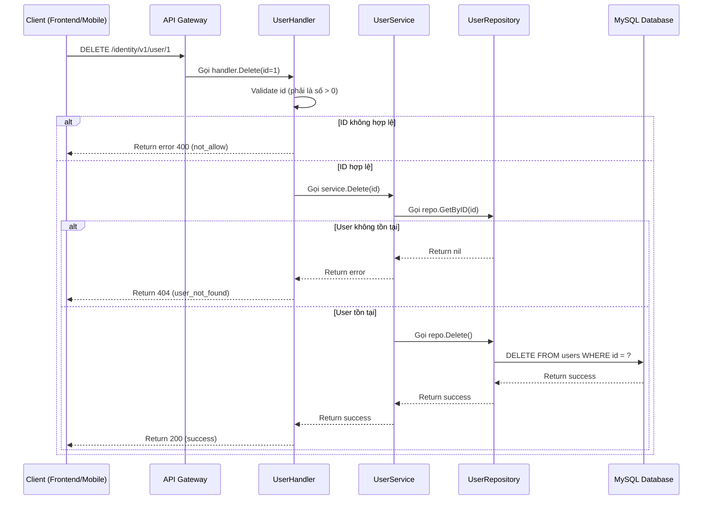
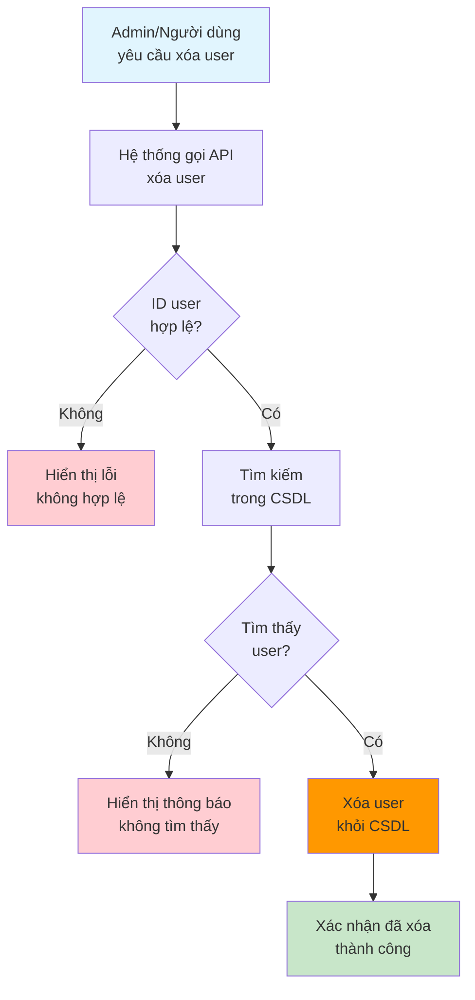

# API: Xóa User

## Tổng quan

| Thuộc tính | Giá trị |
|------------|---------|
| **Method** | DELETE |
| **Endpoint** | `/identity/v1/user/:id` |
| **Mô tả** | Xóa một user khỏi hệ thống theo ID |
| **Tags** | identity |

---

## Mục đích (Dành cho Business/Non-tech)

API này dùng để **xóa vĩnh viễn một người dùng** khỏi hệ thống. Khi user yêu cầu xóa tài khoản hoặc admin cần xóa user không còn hoạt động, hệ thống sẽ gọi API này.

**Ví dụ thực tế:**
- User yêu cầu xóa tài khoản (xóa vĩnh viễn)
- Admin xóa user vi phạm quy định
- Dọn dẹp user test trong môi trường dev

---

## Request Parameters

### Headers

| Parameter | Type | Required | Description |
|-----------|------|----------|-------------|
| Content-Type | string | Yes | `application/json` |
| lang | string | No | Ngôn ngữ trả về: `en` hoặc `vi` |

### Path Parameters

| Parameter | Type | Required | Description |
|-----------|------|----------|-------------|
| id | uint64 | Yes | ID của user cần xóa |

---

## Response

### Success (200)

```json
{
  "code": 200,
  "data": null,
  "message": "success"
}
```

### Error

| Code | Message | Description |
|------|---------|-------------|
| 400 | not_allow | ID không hợp lệ (0 hoặc không phải số) |
| 404 | user_not_found | Không tìm thấy user với ID này |

---

## Sequence Diagram

### Dành cho Developer (Technical)



### Dành cho Business/Non-tech



---

## Ví dụ sử dụng (cURL)

```bash
# Xóa user có ID = 1
curl -X DELETE http://localhost:8080/identity/v1/user/1
```

---

## Lưu ý

1. **Xóa vĩnh viễn**: Đây là xóa cứng (hard delete), dữ liệu sẽ bị xóa vĩnh viễn khỏi database
2. **ID bắt buộc**: Phải cung cấp ID hợp lệ (số nguyên dương)
3. **Không tìm thấy**: Trả về 404 nếu user không tồn tại
4. **Cân nhắc**: Nên cân nhắc sử dụng soft delete (đánh dấu status = 0) thay vì xóa vĩnh viễn để phục hồi nếu cần