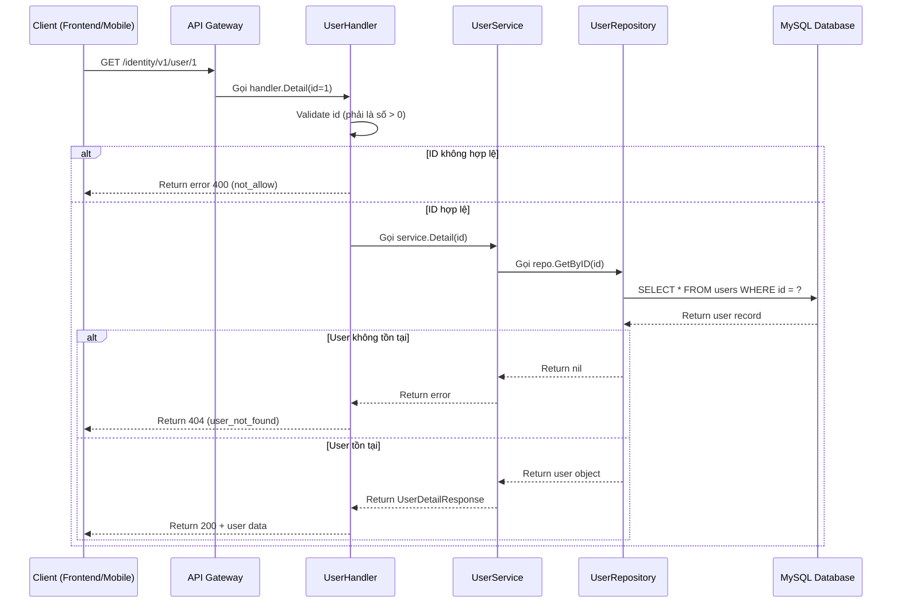
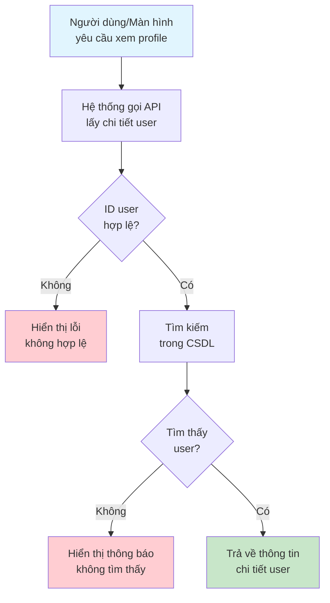

# API: Lấy Chi Tiết User

## Tổng quan

| Thuộc tính | Giá trị |
|------------|---------|
| **Method** | GET |
| **Endpoint** | `/identity/v1/user/:id` |
| **Mô tả** | Lấy thông tin chi tiết của một user theo ID |
| **Tags** | identity |

---

## Mục đích (Dành cho Business/Non-tech)

API này dùng để **lấy thông tin chi tiết của một người dùng** cụ thể trong hệ thống. Khi cần xem profile của user, hoặc hiển thị thông tin user trên giao diện, hệ thống sẽ gọi API này.

**Ví dụ thực tế:**
- Admin xem thông tin chi tiết của một user
- Hiển thị profile người dùng trên trang cá nhân
- Kiểm tra email/username đã tồn tại chưa

---

## Request Parameters

### Headers

| Parameter | Type | Required | Description |
|-----------|------|----------|-------------|
| Content-Type | string | Yes | `application/json` |
| lang | string | No | Ngôn ngữ trả về: `en` hoặc `vi` |

### Path Parameters

| Parameter | Type | Required | Description |
|-----------|------|----------|-------------|
| id | uint64 | Yes | ID của user cần lấy thông tin |

### Query Parameters

| Parameter | Type | Required | Description |
|-----------|------|----------|-------------|
| lang | string | No | Ngôn ngữ trả về (en/vi) |

---

## Response

### Success (200)

```json
{
  "code": 200,
  "data": {
    "id": 1,
    "full_name": "Lich Truong",
    "username": "lichtv",
    "email": "example@imgo.com",
    "created_at": "1991-02-13 10:10:10",
    "modified_at": "2020-07-15 10:10:10",
    "status": 1
  },
  "message": "success"
}
```

### Error

| Code | Message | Description |
|------|---------|-------------|
| 400 | not_allow | ID không hợp lệ (0 hoặc không phải số) |
| 404 | user_not_found | Không tìm thấy user với ID này |

---

## Sequence Diagram

### Dành cho Developer (Technical)



### Dành cho Business/Non-tech



---

## Ví dụ sử dụng (cURL)

```bash
# Lấy thông tin user có ID = 1
curl -X GET http://localhost:8080/identity/v1/user/1

# Lấy thông tin user với ngôn ngữ tiếng Việt
curl -X GET "http://localhost:8080/identity/v1/user/1?lang=vi"
```

---

## Lưu ý

1. **ID bắt buộc**: Phải cung cấp ID hợp lệ (số nguyên dương)
2. **Không tìm thấy**: Trả về 404 nếu user không tồn tại
3. **Thông tin trả về**: Bao gồm id, full_name, username, email, created_at, modified_at, status