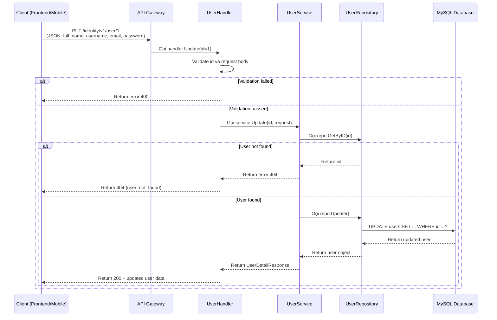
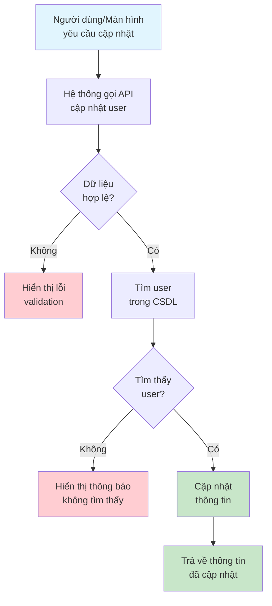

# API: Cập Nhật User

## Tổng quan

| Thuộc tính | Giá trị |
|------------|---------|
| **Method** | PUT |
| **Endpoint** | `/identity/v1/user/:id` |
| **Mô tả** | Cập nhật thông tin của một user theo ID |
| **Tags** | identity |

---

## Mục đích (Dành cho Business/Non-tech)

API này dùng để **cập nhật thông tin của một người dùng** đã có trong hệ thống. Khi user muốn thay đổi thông tin cá nhân (họ tên, email) hoặc admin cần cập nhật thông tin nhân viên, hệ thống sẽ gọi API này.

**Ví dụ thực tế:**
- User thay đổi email cá nhân
- Admin cập nhật thông tin nhân viên
- User thay đổi username

---

## Request Parameters

### Headers

| Parameter | Type | Required | Description |
|-----------|------|----------|-------------|
| Content-Type | string | Yes | `application/json` |
| lang | string | No | Ngôn ngữ trả về: `en` hoặc `vi` |

### Path Parameters

| Parameter | Type | Required | Description |
|-----------|------|----------|-------------|
| id | uint64 | Yes | ID của user cần cập nhật |

### Body

```json
{
  "full_name": "Lich Truong Updated",
  "username": "lichtv_new",
  "email": "newemail@imgo.com",
  "password": "newpassword123"
}
```

### Parameters Detail

| Field | Type | Required | Constraints | Description |
|-------|------|----------|-------------|-------------|
| full_name | string | No | 3-50 ký tự | Họ và tên đầy đủ |
| username | string | No | Chỉ chứa a-z, A-Z, 0-9, dấu gạch ngang | Tên đăng nhập |
| email | string | No | Định dạng email hợp lệ | Địa chỉ email |
| password | string | No | Tối thiểu 8 ký tự | Mật khẩu mới |

---

## Response

### Success (200)

```json
{
  "code": 200,
  "data": {
    "id": 1,
    "full_name": "Lich Truong Updated",
    "username": "lichtv_new",
    "email": "newemail@imgo.com",
    "created_at": "1991-02-13 10:10:10",
    "modified_at": "2024-01-15 10:10:10",
    "status": 1
  },
  "message": "success"
}
```

### Error

| Code | Message | Description |
|------|---------|-------------|
| 400 | not_allow | ID không hợp lệ |
| 400 | invalid_email | Email không đúng định dạng |
| 400 | user_not_found | Không tìm thấy user |
| 400 | email_already_exists | Email đã được sử dụng bởi user khác |

---

## Sequence Diagram

### Dành cho Developer (Technical)



### Dành cho Business/Non-tech



---

## Ví dụ sử dụng (cURL)

```bash
# Cập nhật user có ID = 1
curl -X PUT http://localhost:8080/identity/v1/user/1 \
  -H "Content-Type: application/json" \
  -d '{
    "full_name": "Lich Truong Updated",
    "username": "lichtv_new",
    "email": "newemail@imgo.com"
  }'
```

---

## Lưu ý

1. **Cập nhật một phần**: Chỉ cần gửi các trường cần thay đổi, không bắt buộc gửi tất cả
2. **Validation**: Các trường gửi lên vẫn được validate đầy đủ
3. **ModifiedAt**: Trường modified_at sẽ được cập nhật tự động